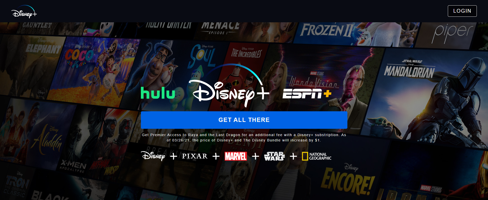

# Disney+ Clone 🎥✨  

A Disney+ Clone built with modern web technologies, mimicking the popular streaming platform's design and functionality. This application features dynamic content, responsive design, and state management with Redux, along with Firebase for backend integration.

## 🚀 Features  
- **Home Page:** Display of trending movies and shows in an interactive and responsive interface.  
- **Google OAuth Authentication:** Secure sign-in functionality using Google OAuth via Firebase.  
- **Redux for State Management:** Efficient state handling for seamless user experience.  
- **Firebase Backend:** Real-time database and hosting for robust backend functionality.  
- **Responsive Design:** Optimized layout for various devices, including desktops, tablets, and smartphones.  
- **Styled Components:** Modular and dynamic CSS styling for maintaining design consistency.  

## 🛠️ Technologies Used  
- **Frontend Framework:** React  
- **State Management:** Redux  
- **Styling:** Styled Components  
- **Backend:** Firebase (for authentication, database, and hosting)  
- **Authentication:** Google OAuth with Firebase  

## 📸 Screenshot
    

## 📸 Demo  
    Deployment URL : https://disneyplus-clone-b7b4a.web.app/  

## 🏗️ Installation and Setup  
1. Clone the repository:  
   ```bash  
   git clone https://github.com/lakshyakalia/disney-clone.git  
   cd disney-clone  
   ```  

2. Install dependencies:  
   ```bash  
   npm install  
   ```  

3. Create a Firebase project:  
   - Go to [Firebase Console](https://console.firebase.google.com/).  
   - Create a new project and set up Authentication (enable Google Sign-In).  
   - Add Firebase configuration to your app by replacing the `firebaseConfig` in your project.  

4. Start the development server:  
   ```bash  
   npm start  
   ```  

5. Open your browser and go to:  
   ```  
   http://localhost:3000  
   ```  

## 📡 Deployment  
To deploy the application:  
1. Build the production version:  
   ```bash  
   npm run build  
   ```  

2. Deploy to Firebase Hosting:  
   - Install Firebase CLI:  
     ```bash  
     npm install -g firebase-tools  
     ```  
   - Login to Firebase:  
     ```bash  
     firebase login  
     ```  
   - Initialize Firebase in your project:  
     ```bash  
     firebase init  
     ```  
   - Deploy your application:  
     ```bash  
     firebase deploy  
     ```  

## 🤝 Contributing  
Contributions, issues, and feature requests are welcome!  
Feel free to check the [issues page](https://github.com/lakshyakalia/disney-clone/issues).  

## 💡 Acknowledgements  
- Inspired by Disney+ for its design and functionality.  
- Firebase for backend services.  

## 📝 License  
This project is licensed under the MIT License - see the [LICENSE](LICENSE) file for details.  

## 📬 Contact  
For questions or collaboration, feel free to reach out:  
- **Email:** lakshyakalia1998@gmail.com  
- **GitHub:** [Your GitHub Profile](https://github.com/lakshyakalia)  

---  
⭐ **If you like this project, consider giving it a star!**  
